# CoRGI: Chain of Reasoning with Grounded Insights

[](LICENSE)
[](https://www.python.org/downloads/)
[](https://github.com/huggingface/transformers)

**CoRGI** is a modular framework that enhances reasoning reliability in vision-language models (VLMs) through **post-hoc visual verification** of chain-of-thought outputs. Unlike traditional VLMs that generate fluent but unverified reasoning chains (single-look bias), CoRGI performs structured reasoning first, then verifies each step against actual visual evidence, reducing hallucinations and improving faithfulness.

## 🌟 Key Features

### Pipeline V2 (Latest)
- **Merged Phase 1+2**: Single VLM call generates both reasoning steps and bounding boxes
- **Smart Evidence Routing**: Automatic classification → Object captioning OR OCR (not both)
- **Integrated Grounding**: Bounding boxes from reasoning phase (optional fallback grounding)
- **37% faster**: Reduced from ~10s to ~6.3s per inference
- **Memory Efficient**: 67% less VRAM with `reuse_reasoning: true`

### Core Capabilities
- **Modular Architecture**: Mix and match different VLMs for each stage
- **Multi-Model Support**: Qwen3-VL, Florence-2, SmolVLM2, FastVLM, PaddleOCR-VL
- **Flash Attention 3**: Optimized kernels for 2-3x speedup
- **Flexible Configuration**: YAML-based pipeline configuration
- **Rich Outputs**: JSON results, visualizations, cropped evidence regions

---

## 📋 Table of Contents

- [Architecture](#-architecture)
- [Installation](#-installation)
- [Quick Start](#-quick-start)
- [Pipeline V2 vs V1](#-pipeline-v2-vs-v1)
- [Configuration](#-configuration)
- [Model Support](#-model-support)
- [Project Structure](#-project-structure)
- [Documentation](#-documentation)
- [Performance](#-performance)
- [Examples](#-examples)
- [Contributing](#-contributing)

---

## 🏗️ Architecture

### Pipeline V2 Flow (Mermaid)

```mermaid
flowchart TD
    subgraph INPUT
        A[🖼️ Image + ❓ Question]
    end

    subgraph PHASE_1_2["Phase 1+2: Reasoning + Grounding (Merged)"]
        B[🧠 Qwen3-VL-2B-Instruct]
        B --> |"Chain-of-Thought"| C["📝 Structured Steps<br/>• statement<br/>• need_object_captioning<br/>• need_text_ocr<br/>• bbox [x1,y1,x2,y2]"]
    end

    subgraph PHASE_3["Phase 3: Smart Evidence Routing"]
        D{Evidence Type?}
        E[🎨 SmolVLM2<br/>Object Caption]
        F[📄 Florence-2<br/>Text OCR]
        D -->|need_object_captioning| E
        D -->|need_text_ocr| F
    end

    subgraph PHASE_4["Phase 4: Answer Synthesis"]
        G[🧠 Qwen3-VL<br/>reused from Phase 1]
    end

    subgraph OUTPUT
        H["✅ Answer + Explanation<br/>📊 Evidence with BBoxes<br/>📈 trace.json (optional)"]
    end

    A --> B
    C --> D
    E --> G
    F --> G
    G --> H

    style B fill:#e1f5fe
    style E fill:#fff3e0
    style F fill:#f3e5f5
    style G fill:#e1f5fe
    style H fill:#e8f5e9
```



### Pipeline Flow (ASCII)

```
┌─────────────────────────────────────────────────────────────┐
│  INPUT: Image + Question                                     │
└───────────────────────┬─────────────────────────────────────┘
                        │
        ┌───────────────▼────────────────┐
        │  Phase 1+2 MERGED              │
        │  Qwen3-VL-2B-Instruct          │
        │  ┌──────────────────────────┐  │
        │  │ <THINKING>               │  │
        │  │ Chain-of-thought...      │  │
        │  │ </THINKING>              │  │
        │  │                          │  │
        │  │ <STRUCTURED_STEPS>       │  │
        │  │ {                        │  │
        │  │   "steps": [             │  │
        │  │     {                    │  │
        │  │       "statement": "...", │  │
        │  │       "need_object": T,  │  │
        │  │       "need_text": F,    │  │
        │  │       "bbox": [x,y,w,h]  │  │
        │  │     }                    │  │
        │  │   ]                      │  │
        │  │ }                        │  │
        │  │ </STRUCTURED_STEPS>      │  │
        │  └──────────────────────────┘  │
        └───────────────┬────────────────┘
                        │
        ┌───────────────▼────────────────┐
        │  Phase 3: Smart Routing        │
        │  ┌──────────────┬────────────┐ │
        │  │ need_object? │ need_text? │ │
        │  │      ↓       │     ↓      │ │
        │  │  SmolVLM2    │ Florence-2 │ │
        │  │  Caption     │    OCR     │ │
        │  └──────────────┴────────────┘ │
        └───────────────┬────────────────┘
                        │
        ┌───────────────▼────────────────┐
        │  Phase 4: Answer Synthesis     │
        │  Qwen3-VL-2B-Instruct          │
        │  (reused from Phase 1)         │
        └───────────────┬────────────────┘
                        │
┌───────────────────────▼─────────────────────────────────────┐
│  OUTPUT: Answer + Explanation + Key Evidence (with bboxes)  │
└─────────────────────────────────────────────────────────────┘
```

### V2 Design Principles

1. **Efficiency**: Minimize VLM calls by integrating grounding into reasoning
2. **Accuracy**: Let model decide evidence type (object vs text) per step
3. **Modularity**: Pluggable components for each stage
4. **Scalability**: Batch processing and parallel evidence extraction

---

## 🚀 Installation

### Prerequisites

- Python 3.10+
- CUDA 11.8+ (for GPU acceleration)
- 16GB+ VRAM recommended (can run on 8GB with optimizations)

### Method 1: From Source

```bash
# Clone repository
git clone https://github.com/yourusername/corgi_implementation.git
cd corgi_implementation/corgi_custom

# Create virtual environment
python -m venv venv
source venv/bin/activate  # Linux/Mac
# or: venv\Scripts\activate  # Windows

# Install dependencies
pip install -r requirements.txt

# Install development version of transformers (for Qwen3-VL support)
pip install git+https://github.com/huggingface/transformers.git

# Install additional packages
pip install timm  # For Florence-2
```

### Method 2: Docker (Coming Soon)

```bash
docker pull ghcr.io/yourusername/corgi:latest
docker run -it --gpus all ghcr.io/yourusername/corgi:latest
```

---

## ⚡ Quick Start

### Unified CLI Inference

```bash
# Default (V2 pipeline, auto-detect from config)
python inference.py --image test_image.jpg --question "What do you see?" --output results/

# Explicit pipeline version
python inference.py --pipeline v2 --image test_image.jpg --question "..."
python inference.py --pipeline v1 --image test_image.jpg --question "..."

# With custom config
python inference.py --config configs/qwen_florence2_smolvlm2_v2.yaml --image photo.jpg --question "..."

# Batch processing
python inference.py --batch questions.txt --output batch_results/
```

### Traced Inference (Debugging)

Full component tracing with HTML report for debugging:

```bash
# Run with full tracing
python inference_traced.py --image photo.jpg --question "What is this?" --output results/trace

# Open HTML report automatically
python inference_traced.py --image photo.jpg --question "..." --output results/trace --open-report
```

**Output structure:**
```
results/trace/
├── trace.json           # Complete trace data (all component I/O)
├── trace_report.html    # Visual HTML report 🌐
├── summary.txt          # Quick summary
├── images/original.jpg  # Input image
├── crops/*.jpg          # Cropped input regions per component
├── visualizations/*.jpg # Images with bboxes drawn
└── prompts/*.txt        # Component prompts
```

### Unified Gradio UI

```bash
# Default (V2 pipeline, standard mode)
python app_unified.py

# Chatbot mode with streaming (⭐ Recommended)
python app_unified.py --mode chatbot

# V1 pipeline
python app_unified.py --pipeline v1

# Custom port and share link
python app_unified.py --port 7861 --share

# HuggingFace Spaces mode
python app_unified.py --spaces
```

#### Chatbot Streaming Mode (⭐ Recommended)

Real-time streaming interface with step-by-step execution:

```bash
python app_unified.py --mode chatbot
# Or direct launch:
python gradio_chatbot_v2.py
# Open browser at http://localhost:7860
```

**Features:**
- ✅ Real-time streaming of each phase
- ✅ Progressive bbox visualization
- ✅ Chatbot-style conversation
- ✅ Live progress updates

#### Standard Interface

Traditional form-based UI with final results:

```bash
python app_unified.py
# Open browser at http://localhost:7860
```

### Python API

```python
from PIL import Image
from corgi.core.pipeline_v2 import CoRGIPipelineV2
from corgi.models.factory import VLMClientFactory
from corgi.core.config import load_config

# Load configuration
config = load_config("configs/qwen_only_v2.yaml")

# Create VLM client
client = VLMClientFactory.create_from_config(config)

# Initialize pipeline
pipeline = CoRGIPipelineV2(vlm_client=client)

# Run inference
image = Image.open("test_image.jpg")
question = "What objects are in this image?"

result = pipeline.run(
    image=image,
    question=question,
    max_steps=6,
    max_regions=1
)

# Access results
print(f"Answer: {result.answer}")
print(f"Explanation: {result.explanation}")
print(f"Evidence count: {len(result.evidence)}")
print(f"Performance: {result.total_duration_ms:.0f}ms")
```

### Streaming API

For real-time, progressive display of pipeline results:

```python
from corgi.core import CoRGIPipelineV2, StreamEventType

# Stream execution with events
for event in pipeline.run_streaming(image, question):
    if event.type == StreamEventType.PHASE_START:
        print(f"Starting: {event.phase}")
    elif event.type == StreamEventType.STEP:
        print(f"Step {event.step_index}: {event.data['statement']}")
    elif event.type == StreamEventType.EVIDENCE:
        print(f"Evidence: {event.data['evidence_type']}")
    elif event.type == StreamEventType.ANSWER:
        print(f"Answer: {event.data['answer']}")
    elif event.type == StreamEventType.PIPELINE_END:
        print(f"Total time: {event.data['total_duration_ms']:.0f}ms")
```

**Available Event Types:**
- `PIPELINE_START/END` - Lifecycle events
- `PHASE_START/END` - Phase lifecycle
- `COT_TEXT` - Chain-of-thought generated
- `STEP` - Reasoning step with optional bbox
- `BBOX` - Bounding box from fallback grounding
- `EVIDENCE` - OCR or caption extracted
- `ANSWER` - Final answer generated
- `KEY_EVIDENCE` - Key evidence items
- `WARNING/ERROR` - Non-fatal warnings or errors

---

## 🔄 Pipeline V2 vs V1

| Feature | V1 (Legacy) | V2 (Current) | Improvement |
|---------|-------------|--------------|-------------|
| **Reasoning + Grounding** | 2 separate calls | 1 merged call | **-35% latency** |
| **Evidence Extraction** | Always OCR + Caption | Smart routing | **-49% latency** |
| **Bbox Source** | Always grounding model | Reasoning model first | **-50% grounding calls** |
| **Memory (3 models)** | 18GB VRAM | 6GB VRAM | **-67% memory** |
| **Total Latency** | ~10.0s | ~6.3s | **-37% faster** |
| **Evidence Type** | Fixed | Model-decided | **Better accuracy** |

### When to Use V1 vs V2

**Use V2 (Recommended)**:
- General-purpose VQA
- Resource-constrained environments
- Need faster inference
- Want automatic evidence type detection

**Use V1**:
- Maximum evidence detail (always OCR + Caption)
- Separate model optimization for each stage
- Legacy compatibility

---

## ⚙️ Configuration

### Example: Qwen-Only V2 Pipeline

```yaml
# configs/qwen_only_v2.yaml
reasoning:
  model:
    model_type: qwen_instruct
    model_id: Qwen/Qwen3-VL-4B-Instruct
    device: cuda:0
    torch_dtype: bfloat16
    use_v2_prompt: true
    enable_compile: false

grounding:
  reuse_reasoning: true  # Reuse reasoning model

captioning:
  model:
    model_type: qwen_captioning_adapter
    model_id: Qwen/Qwen3-VL-4B-Instruct
    device: cuda:0

synthesis:
  reuse_reasoning: true  # Reuse reasoning model

pipeline:
  max_reasoning_steps: 6
  max_regions_per_step: 1
  use_v2: true

nms:
  enabled: true
  iou_threshold: 0.5
```

### Multi-Model Configuration

```yaml
# configs/qwen_florence2_smolvlm2_v2.yaml
reasoning:
  model:
    model_type: qwen_instruct
    model_id: Qwen/Qwen3-VL-2B-Instruct
    device: cuda:0

grounding:
  reuse_reasoning: true

captioning:
  model:
    model_type: composite
  ocr:
    model_type: florence
    model_id: florence-community/Florence-2-large-ft
    device: cuda:1
  caption:
    model_type: smolvlm
    model_id: HuggingFaceTB/SmolVLM2-1.7B-Instruct
    device: cuda:1

synthesis:
  model:
    model_type: qwen_instruct
    model_id: Qwen/Qwen3-VL-2B-Instruct
    device: cuda:0

pipeline:
  use_v2: true
```

---

## 🤖 Model Support

### Reasoning Models

| Model | Size | VRAM | Speed | Quality | V2 Support |
|-------|------|------|-------|---------|------------|
| **Qwen/Qwen3-VL-2B-Instruct** | 2B | 6GB | Fast | Good | ✅ |
| **Qwen/Qwen3-VL-4B-Instruct** | 4B | 10GB | Medium | Excellent | ✅ |
| Qwen/Qwen3-VL-8B-Instruct | 8B | 18GB | Slow | Best | ✅ |

### Grounding Models

| Model | Type | Speed | Accuracy |
|-------|------|-------|----------|
| **Qwen3-VL (reused)** | Instruct | Fast | Good |
| Florence-2-large-ft | Specialized | Very Fast | Excellent |

### Captioning Models

| Model | Type | Speed | Quality |
|-------|------|-------|---------|
| **Qwen3-VL (adapter)** | General VLM | Medium | Excellent |
| SmolVLM2-1.7B | Efficient VLM | Fast | Good |
| FastVLM-0.5B | Ultra-light | Very Fast | Fair |

### OCR Models

| Model | Speed | Text Accuracy |
|-------|-------|---------------|
| **Florence-2-large-ft** | Very Fast | Excellent |
| PaddlePaddle/PaddleOCR-VL | Fast | Excellent |

---

## 📁 Project Structure

```
corgi_custom/
├── corgi/                          # Main package
│   ├── core/                       # Core pipeline components
│   │   ├── pipeline.py             # V1 pipeline (legacy)
│   │   ├── pipeline_v2.py          # V2 pipeline (current) ⭐
│   │   ├── streaming.py            # Streaming API ⭐ NEW
│   │   ├── types.py                # V1 data models
│   │   ├── types_v2.py             # V2 data models
│   │   └── config.py               # Configuration schemas
│   ├── models/                     # VLM clients
│   │   ├── factory.py              # Composite VLM client factory
│   │   ├── qwen/                   # Qwen model clients
│   │   ├── florence/               # Florence-2 clients
│   │   ├── smolvlm/                # SmolVLM2 client
│   │   ├── fastvlm/                # FastVLM client
│   │   ├── vintern/                # Vintern client
│   │   └── composite/              # Composite captioning
│   └── utils/                      # Utilities
│       ├── inference_helpers.py    # Shared inference utilities ⭐ NEW
│       ├── trace_reporter.py       # Trace reporter for debugging ⭐ NEW
│       ├── prompts_v2.py           # V2 prompt templates
│       ├── parsers_v2.py           # V2 response parsers
│       └── coordinate_utils.py     # Bbox coordinate handling
├── configs/                        # Configuration files
│   ├── README.md                   # Config guide ⭐ NEW
│   ├── qwen_only_v2.yaml           # Qwen-only V2 config (recommended)
│   ├── qwen_florence2_smolvlm2_v2.yaml  # Multi-model V2
│   └── legacy/                     # V1 configs (backward compat)
├── docs/                           # Documentation
│   ├── QUICK_REFERENCE.md          # Quick usage guide ⭐ NEW
│   ├── CODEBASE_ANALYSIS.md        # Codebase analysis
│   ├── REFACTOR_ROADMAP.md         # Refactoring roadmap
│   └── REFACTOR_PLAN.md            # Refactoring plan
├── tests/                          # Test suite
│   ├── integration/                # Integration tests
│   │   ├── test_real_pipeline.py   # V1 pipeline test
│   │   └── test_unified_pipeline.py # Unified pipeline test ⭐ NEW
│   └── unit/                       # Unit tests
├── archive/                        # Archived legacy files
│   ├── legacy_entrypoints/         # Old app entrypoints
│   └── legacy_inference/           # Old inference scripts
│
│ ── ENTRYPOINTS (Use These) ────────
├── inference.py                    # Unified CLI inference (V1+V2) ⭐
├── inference_traced.py             # Traced inference with HTML report ⭐ NEW
├── app_unified.py                  # Unified Gradio app (all modes) ⭐
├── gradio_chatbot_v2.py            # Streaming chatbot UI ⭐
│
│ ── DEPRECATED (Backward Compat) ───
├── inference_v2.py                 # (deprecated → use inference.py)
├── app_v2.py                       # (deprecated → use app_unified.py)
├── app_qwen_only.py                # (deprecated → use app_unified.py)
├── app.py                          # (deprecated → use app_unified.py)
│
├── requirements.txt                # Python dependencies
└── README.md                       # This file
```

---

## 📚 Documentation

### Core Documentation

| Document | Description |
|----------|-------------|
| [PIPELINE_V2_SUMMARY.md](docs/pipeline_v2/PIPELINE_V2_SUMMARY.md) | Complete V2 architecture overview |
| [ARCHITECTURE_REVIEW_V2.md](docs/pipeline_v2/ARCHITECTURE_REVIEW_V2.md) | V1 vs V2 detailed comparison |
| [TEST_SESSION_SUMMARY.md](docs/pipeline_v2/TEST_SESSION_SUMMARY.md) | Testing process and fixes |
| [V2_TEST_PROGRESS.md](docs/pipeline_v2/V2_TEST_PROGRESS.md) | Step-by-step test progress |

### Quick References

- **[Quick Start Guide](docs/guides/QUICK_START.md)** - Get started in 30 seconds
- **[Usage Guide](docs/USAGE_GUIDE.md)** - Comprehensive usage instructions
- **[Configuration Guide](docs/guides/CONFIGURATION.md)** - All configuration options
- **[Model Registry](docs/guides/MODEL_REGISTRY.md)** - Supported models and benchmarks

### Advanced Topics

- **[Custom Models](docs/guides/CUSTOM_MODELS.md)** - Integrate your own VLMs
- **[Optimization Guide](docs/OPTIMIZATION_IMPLEMENTATION_SUMMARY.md)** - Performance tuning
- **[Deployment](docs/DEPLOY_NOW.md)** - Deploy to HuggingFace Spaces

---

## 📊 Performance

### Benchmark (V2 Pipeline, Qwen3-VL-4B-Instruct)

**Hardware**: NVIDIA A100 (40GB)

| Metric | Value | Details |
|--------|-------|---------|
| **Total Latency** | 41.7s | End-to-end inference |
| **Phase 1+2** | 30.4s | Reasoning + Grounding merged |
| **Phase 3** | 0.1s | 6 parallel caption calls |
| **Phase 4** | 11.3s | Answer synthesis |
| **Memory Usage** | 10GB VRAM | Single model reused 3x |
| **Bbox Success** | 100% | 6/6 bboxes from Phase 1 |

### Optimization Tips

1. **Enable Flash Attention 3**:
   ```bash
   pip install flash-attn --no-build-isolation
   ```

2. **Use Torch Compile** (PyTorch 2.0+):
   ```yaml
   reasoning:
     model:
       enable_compile: true
   ```

3. **Reduce Resolution**:
   ```yaml
   reasoning:
     model:
       max_pixels: 720  # Default: 1024
   ```

4. **Batch Processing**:
   ```bash
   python inference_v2.py --batch-file questions.jsonl
   ```

---

## 💡 Examples

### Example 1: Document Understanding

```bash
python inference_v2.py \
  --image invoice.pdf \
  --question "What is the total amount?" \
  --config configs/qwen_only_v2.yaml
```

**Output**:
```json
{
  "answer": "$1,234.56",
  "explanation": "The invoice shows a subtotal of $1,100.00, tax of $99.00, and shipping of $35.56, totaling $1,234.56.",
  "evidence": [
    {
      "step_index": 1,
      "statement": "Locate the 'Total' field in the invoice",
      "bbox": [0.65, 0.82, 0.95, 0.88],
      "evidence_type": "text",
      "ocr_text": "TOTAL: $1,234.56",
      "confidence": 0.98
    }
  ]
}
```

### Example 2: Scene Understanding

```bash
python inference_v2.py \
  --image street.jpg \
  --question "How many yellow taxis are visible?" \
  --config configs/qwen_only_v2.yaml
```

**Output**:
```json
{
  "answer": "Three yellow taxis are visible in the image.",
  "explanation": "The image shows three distinct yellow vehicles with taxi markings on the street.",
  "evidence": [
    {
      "step_index": 1,
      "statement": "Identify and count yellow taxi vehicles",
      "bbox": [0.20, 0.65, 0.80, 0.85],
      "evidence_type": "object",
      "description": "Three yellow taxi cabs driving on the street",
      "confidence": 0.92
    }
  ]
}
```

### Example 3: Multi-Step Reasoning

```bash
python inference_v2.py \
  --image chart.png \
  --question "Which category had the highest growth rate?" \
  --config configs/qwen_only_v2.yaml
```

**Reasoning Steps**:
1. Identify chart type and axes labels (text OCR)
2. Extract numerical values for each category (text OCR)
3. Calculate growth rates from values (pure reasoning)
4. Compare growth rates to find maximum (pure reasoning)
5. Identify category name with highest rate (synthesis)

---

## 🛠️ Development

### Running Tests

```bash
# All tests
pytest tests/

# Integration tests
pytest tests/integration/ -v

# Unified pipeline tests (new)
python tests/integration/test_unified_pipeline.py

# Or with pytest
pytest tests/integration/test_unified_pipeline.py -v

# Quick smoke test
python -c "from corgi.core import CoRGIPipelineV2, StreamEventType; print('OK')"
```

### Code Formatting

```bash
# Format with Black
black corgi/

# Lint with Ruff
ruff check corgi/

# Type checking with MyPy
mypy corgi/
```

### Adding a New Model

1. Create client in `corgi/models/your_model/`
2. Register in `corgi/models/factory.py`
3. Add configuration schema in `corgi/core/config.py`
4. Create YAML config in `configs/`
5. Add tests in `tests/models/`

See [Custom Models Guide](docs/guides/CUSTOM_MODELS.md) for details.

---

## 🤝 Contributing

We welcome contributions! Please see [CONTRIBUTING.md](CONTRIBUTING.md) for guidelines.

### Areas for Contribution

- **New Models**: Integrate additional VLMs (LLaVA, CogVLM, etc.)
- **Optimizations**: Performance improvements, memory reduction
- **Features**: Batch processing, caching, multi-GPU support
- **Documentation**: Tutorials, examples, translations
- **Testing**: Unit tests, integration tests, benchmarks

---

## 📄 License

This project is licensed under the Apache License 2.0 - see [LICENSE](LICENSE) file for details.

---

## 🙏 Acknowledgements

- **Qwen Team** at Alibaba for Qwen3-VL models
- **Microsoft** for Florence-2 grounding models
- **HuggingFace** for Transformers library and model hosting
- **SmolVLM Team** for efficient VLM research
- Original **CoRGI paper** authors for the framework concept

---

## 📞 Contact & Support

- **Issues**: [GitHub Issues](https://github.com/yourusername/corgi_implementation/issues)
- **Discussions**: [GitHub Discussions](https://github.com/yourusername/corgi_implementation/discussions)
- **Email**: your.email@example.com

---

## 📈 Roadmap

### Q1 2025
- [ ] Multi-GPU support for pipeline parallelism
- [ ] Batch processing optimization
- [ ] Docker images for easy deployment
- [ ] API server with FastAPI

### Q2 2025
- [ ] Video understanding support
- [ ] Multi-turn dialogue capabilities
- [ ] KV cache optimization
- [ ] Mobile deployment (ONNX)

### Q3 2025
- [ ] Multi-lingual support (non-English)
- [ ] Fine-tuning scripts for custom domains
- [ ] Cloud deployment templates (AWS, Azure, GCP)
- [ ] Performance benchmarking suite

---

## 📊 Citation

If you use CoRGI in your research, please cite:

```bibtex
@misc{corgi2024,
  title={CoRGI: Chain of Reasoning with Grounded Insights},
  author={Your Name},
  year={2024},
  publisher={GitHub},
  howpublished={\url{https://github.com/yourusername/corgi_implementation}}
}
```

---

<div align="center">

**Made with ❤️ by the CoRGI Team**

[Documentation](docs/) • [Examples](examples/) • [Contributing](CONTRIBUTING.md)

</div>
