# Kiến trúc Pipeline CoRGI: Lý thuyết và Thực hành

## Tổng quan

**CoRGI (Chain-of-Reasoning with Grounded Inference)** là một framework VQA (Visual Question Answering) được thiết kế để giải quyết vấn đề **hallucination** (ảo giác) trong các mô hình VLM (Vision-Language Models). Pipeline kết hợp sức mạnh của **Qwen3-VL** và **Florence-2** để tạo ra câu trả lời chính xác, dựa trên bằng chứng thị giác đã được kiểm chứng.

<div align="center">
  
</div>

## 1. Vấn đề và Động lực

### 1.1. Vấn đề cốt lõi

Các mô hình VLM hiện đại, khi sử dụng Chain-of-Thought (CoT) reasoning, thường tạo ra các lời giải thích ngôn ngữ **trơn tru và có vẻ hợp lý**, nhưng lại **không được kiểm chứng** bởi nội dung thực tế của hình ảnh. Điều này dẫn đến:

- **Hallucination**: Mô hình "nói hay" nhưng không dựa trên thông tin thực tế trong ảnh
- **Thiếu tính đáng tin cậy**: Khó xác định phần nào của câu trả lời dựa trên bằng chứng thị giác
- **Giảm độ chính xác**: Đặc biệt trong các bối cảnh đòi hỏi độ chính xác cao (y tế, pháp lý, giáo dục)

### 1.2. Giải pháp của CoRGI

CoRGI coi đây là **thất bại của khâu kiểm chứng** (verification failure) và giải quyết bằng cách:

1. **Tách biệt suy luận và kiểm chứng**: Tách quá trình suy luận (reasoning) và kiểm chứng bằng chứng (evidence verification) thành các giai đoạn riêng biệt
2. **Grounding rõ ràng**: Mỗi bước suy luận phải được "neo" (grounded) vào các vùng cụ thể trong hình ảnh
3. **Kiểm chứng trước khi tổng hợp**: Chỉ tổng hợp câu trả lời sau khi đã có bằng chứng thị giác được kiểm chứng

## 2. Kiến trúc Pipeline: 4 Giai đoạn

Pipeline CoRGI được thiết kế theo kiến trúc **4 giai đoạn tuần tự**, mỗi giai đoạn có vai trò và mục tiêu rõ ràng:

### 2.1. Stage 1: Chain of Thought Reasoning

**Mục đích lý thuyết**: Sinh ra chuỗi các bước suy luận có cấu trúc từ hình ảnh và câu hỏi. Mỗi bước suy luận là một **mệnh đề** (proposition) có thể được kiểm chứng độc lập.

**Nguyên lý thiết kế**:
- **Decomposability**: Chia câu hỏi phức tạp thành các bước đơn giản hơn
- **Verifiability**: Mỗi bước phải có khả năng được kiểm chứng bằng bằng chứng thị giác
- **Noun phrase extraction**: Statements phải là **noun phrases** (cụm danh từ) để có thể được grounding model định vị trong ảnh

**Model sử dụng**: Qwen3-VL-2B-Instruct (hoặc Qwen3-VL-7B-Instruct)

**Prompt Template**:

```text
You are a careful multimodal reasoner analyzing an image to answer a question.

Question: {question}

First, provide your chain-of-thought reasoning (2-4 natural language sentences explaining your thought process).

Then, identify which reasoning steps require visual verification and output them in JSON format.

CRITICAL: The 'statement' field will be passed to a GROUNDING MODEL that needs to LOCALIZE specific objects/regions in the image.
Therefore, statements MUST be NOUN PHRASES that identify the target object/region, NOT action descriptions.

IMPORTANT GUIDELINES for steps:
1. Each step must verify a DIFFERENT aspect - no duplicate verifications
2. The 'statement' field MUST be a NOUN PHRASE (target object/region), NOT an action:
   - BAD: "Extract the volume of Mercury from the table" (too vague, action-oriented)
   - GOOD: "row for Mercury" or "Volume (km³) column" or "Mercury volume value" (specific noun phrase)
3. Focus on specific OBJECTS or REGIONS using concrete noun phrases that can be localized
4. Keep 'reason' field to 5 words maximum - this explains WHY you need to verify this target
5. Only include steps that REQUIRE seeing the image (not logical deductions)
6. If the step involves reading text, signs, documents, or any textual content, set 'need_ocr': true. Otherwise, set 'need_ocr': false.

Format your response EXACTLY as follows:

# Reasoning:
[Your natural language chain-of-thought here - be concise but thorough]

# Steps to verify:
```json
{
  "steps": [
    {
      "index": 1,
      "statement": "specific noun phrase identifying target object/region",
      "needs_vision": true,
      "need_ocr": false,
      "reason": "brief 3-5 word reason"
    }
  ]
}
```

Limit to {max_steps} steps maximum. Each step must be unique and non-redundant.
```

**Output**: Danh sách `ReasoningStep` objects, mỗi step chứa:
- `index`: Số thứ tự bước
- `statement`: Noun phrase mô tả đối tượng/vùng cần kiểm chứng
- `needs_vision`: Boolean - bước này có cần kiểm chứng thị giác không
- `need_ocr`: Boolean - bước này có cần đọc text không
- `reason`: Lý do ngắn gọn (tối đa 5 từ)

### 2.2. Stage 2: ROI Extraction (Grounding)

**Mục đích lý thuyết**: Với mỗi reasoning step có `needs_vision=True`, trích xuất các bounding boxes (vùng quan tâm) trong hình ảnh tương ứng với statement của step đó. Đây là quá trình **phrase-to-region grounding**.

**Nguyên lý thiết kế**:
- **Spatial localization**: Chuyển đổi từ mô tả ngôn ngữ (text) sang tọa độ không gian (bounding boxes)
- **Deduplication**: Sử dụng Non-Maximum Suppression (NMS) để loại bỏ các bounding boxes trùng lặp
- **Normalization**: Chuẩn hóa tọa độ để đảm bảo tính nhất quán giữa các models

**Model sử dụng**: Florence-2-large-ft (primary, recommended)

**Prompt Template** (cho Florence-2):

Florence-2 sử dụng **task-based prompting**, không cần prompt text. Task được chỉ định là:
```
<CAPTION_TO_PHRASE_GROUNDING>
```

Input format:
```
<CAPTION_TO_PHRASE_GROUNDING>{step_statement}</CAPTION_TO_PHRASE_GROUNDING>
```

**Quy trình xử lý**:

1. **Input**: Reasoning step với `needs_vision=True`
2. **Grounding**: Model trích xuất bounding boxes từ hình ảnh
3. **NMS (Non-Maximum Suppression)**: Loại bỏ các bounding boxes trùng lặp
   - **Method**: IoU-based filtering
   - **Threshold**: Mặc định 0.5 (có thể cấu hình)
   - **Lý do**: Giảm số lượng evidence regions dư thừa, cải thiện hiệu quả
4. **Normalization**: Chuyển đổi coordinates về format chuẩn [0, 1]
5. **Output**: Danh sách `GroundedEvidence` objects

**Output Structure**: Mỗi `GroundedEvidence` chứa:
- `step_index`: Index của reasoning step tương ứng
- `bbox`: Bounding box coordinates (normalized [0, 1])
- `description`: Mô tả ngắn gọn về vùng (optional)
- `confidence`: Độ tin cậy (0.0 - 1.0)

### 2.3. Stage 3: Evidence Description

**Mục đích lý thuyết**: Với mỗi evidence region (bounding box) đã được trích xuất, mô tả chi tiết nội dung của vùng đó bằng cả **text** (OCR) và **visual description** (captioning). Đây là quá trình **region-to-text mapping**.

**Nguyên lý thiết kế**:
- **Dual modality extraction**: Trích xuất cả thông tin text (OCR) và visual (captioning) từ cùng một vùng
- **Parallel processing**: OCR và Captioning chạy song song để tối ưu thời gian
- **Evidence combination**: Kết hợp OCR text và caption thành mô tả đầy đủ

**Model sử dụng**: Florence-2-large-ft (primary, recommended)

**Prompt Template** (cho Florence-2):

Florence-2 sử dụng task-based prompting:

**OCR Task**:
```
<OCR>{cropped_image}</OCR>
```

**Captioning Task**:
```
<MORE_DETAILED_CAPTION>{cropped_image}</MORE_DETAILED_CAPTION>
```

**Quy trình xử lý**:

1. **Region Cropping**: Cắt vùng từ hình ảnh gốc theo bounding box
2. **Parallel Processing**: Chạy OCR và Captioning **song song** cho mỗi region
   - **Method**: `ThreadPoolExecutor` để xử lý parallel
   - **Lý do**: Tối ưu thời gian, mỗi region chỉ crop một lần
3. **Evidence Combination**: Kết hợp OCR text và caption thành mô tả đầy đủ
4. **Output**: Cập nhật `GroundedEvidence` với:
   - `ocr_text`: Text được trích xuất (nếu có)
   - `caption`: Mô tả thị giác chi tiết

**Output Structure**: Mỗi `GroundedEvidence` sau stage này sẽ có:
- `step_index`: Index của reasoning step
- `bbox`: Bounding box coordinates
- `description`: Mô tả tổng hợp (OCR + Caption)
- `ocr_text`: Text được trích xuất (optional)
- `caption`: Mô tả thị giác (optional)
- `confidence`: Độ tin cậy

### 2.4. Stage 4: Answer Synthesis

**Mục đích lý thuyết**: Tổng hợp tất cả thông tin (question, reasoning steps, verified evidence) để tạo ra câu trả lời cuối cùng. Câu trả lời phải **dựa trên bằng chứng đã được kiểm chứng**, không phải suy đoán.

**Nguyên lý thiết kế**:
- **Evidence-based reasoning**: Câu trả lời phải dựa trên verified evidence
- **Key evidence selection**: Chỉ chọn tối đa 1 evidence quan trọng nhất để tránh quá tải
- **Explanation generation**: Tạo giải thích ngắn gọn (2-3 câu) kết nối bằng chứng với câu trả lời

**Model sử dụng**: Qwen3-VL-2B-Instruct (hoặc Qwen3-VL-7B-Instruct)

**Prompt Template**:

```text
You are finalizing the answer using verified evidence.

Question: {question}

Structured reasoning steps:
{steps}

Verified visual evidence (bounding boxes in [0-999] coordinates):
{evidence}

IMPORTANT INSTRUCTIONS:
1. Provide at most 1 key evidence item (the most important one)
2. Keep the answer concise and direct
3. Provide a brief explanation (2-3 sentences) connecting the key evidence to the answer

Please provide your final answer in this EXACT JSON format (use [0-999] coordinate range):
{
  "answer": "Final answer",
  "explanation": "Brief explanation connecting evidence to answer",
  "key_evidence": [
    {
      "bbox": [x1, y1, x2, y2],
      "description": "What this region shows",
      "reasoning": "Why this supports the answer"
    }
  ]
}

Field order must be: answer first, then explanation, then key_evidence.

If you cannot provide structured evidence, just give:
{"answer": "your answer", "explanation": "Brief explanation", "key_evidence": []}

Use [0, 999] coordinate range for bboxes (NOT normalized 0-1). Do not include <think> tags. Respond with JSON only.
```

**Input Format**:

**Steps format**:
```
1. the watch on the woman's wrist (needs vision: True)
2. the color indicator (needs vision: True)
```

**Evidence format**:
```
Step 1: bbox=(539, 571, 568, 612), conf=0.95, desc=A person is wearing a white watch on their wrist.
Step 2: bbox=(100, 200, 150, 250), conf=0.88, desc=The color indicator shows white.
```

**Output Structure**:
```json
{
  "answer": "The watch is white.",
  "explanation": "Based on the visual evidence, I can see a white watch on the woman's wrist. The color indicator confirms this is white.",
  "key_evidence": [
    {
      "bbox": [539, 571, 568, 612],
      "description": "A person is wearing a white watch on their wrist",
      "reasoning": "This is the primary visual evidence that directly answers the question about the watch color"
    }
  ]
}
```

## 3. Nguyên lý Thiết kế và Kỹ thuật

### 3.1. Non-Maximum Suppression (NMS)

**Lý thuyết**: NMS là một kỹ thuật trong computer vision để loại bỏ các bounding boxes trùng lặp. Trong CoRGI, NMS được sử dụng để:

- **Giảm redundancy**: Loại bỏ các bounding boxes trùng lặp từ kết quả grounding
- **Cải thiện hiệu quả**: Giảm số lượng evidence regions cần xử lý ở stage tiếp theo
- **Tăng độ chính xác**: Chỉ giữ lại bounding box có confidence cao nhất trong mỗi nhóm trùng lặp

**Method**: IoU-based filtering với threshold có thể cấu hình (mặc định: 0.5)

**Implementation**: `coordinate_utils.non_maximum_suppression()`

### 3.2. Parallel OCR and Captioning

**Lý thuyết**: OCR và Captioning là hai tasks độc lập có thể chạy song song trên cùng một vùng hình ảnh. Việc xử lý song song giúp:

- **Tối ưu thời gian**: Giảm thời gian xử lý tổng thể
- **Tận dụng tài nguyên**: Sử dụng hiệu quả GPU/CPU
- **Single crop**: Mỗi region chỉ crop một lần, dùng cho cả OCR và Captioning

**Method**: Unified batch processing với `ThreadPoolExecutor`

**Implementation**: `Florence2CaptioningClient.ocr_and_caption_regions_batch()`

### 3.3. Coordinate System Handling

**Lý thuyết**: Các models khác nhau sử dụng các hệ tọa độ khác nhau:
- **Normalized [0, 1]**: Tọa độ được chuẩn hóa theo kích thước ảnh
- **Pixel [0, 999]**: Tọa độ trong phạm vi 0-999 (Qwen format)
- **Absolute pixel**: Tọa độ pixel tuyệt đối

**Vấn đề**: Cần chuyển đổi giữa các formats để đảm bảo tính nhất quán

**Giải pháp**: Tự động chuyển đổi giữa các formats với format detection

**Implementation**: `coordinate_utils.py` với format detection

### 3.4. KV Cache Optimization

**Lý thuyết**: KV Cache là một kỹ thuật tối ưu trong transformer inference, cache các key-value states từ các tokens trước đó để tránh tính toán lại.

**Lợi ích**:
- **Tăng tốc inference**: Đặc biệt cho multi-step reasoning
- **Giảm memory access**: Giảm số lần truy cập memory

**Method**: `use_cache=True` trong generation parameters

**Implementation**: Enabled cho Qwen models

### 3.5. SDPA Attention (Florence-2)

**Lý thuyết**: SDPA (Scaled Dot Product Attention) là một implementation tối ưu của attention mechanism trong PyTorch, sử dụng Flash Attention để tăng tốc.

**Yêu cầu**: Florence-2 yêu cầu SDPA để hoạt động đúng

**Method**: `attn_implementation="sdpa"` trong model loading

**Implementation**: Enforced tại model loading time

## 4. So sánh với các Phương pháp Khác

### 4.1. Visual CoT

**Visual CoT** là một dataset và benchmark với 438k QA pairs, trong đó ~98k có bước suy luận với bbox làm "thought" thị giác. Visual CoT hướng dẫn mô hình:
- **Tập trung theo vùng**: Focus vào các vùng cụ thể trong ảnh
- **Giải thích đa lượt**: Giải thích qua nhiều bước

**Khác biệt với CoRGI**:
- Visual CoT: Tập trung vào dataset và training
- CoRGI: Tập trung vào inference-time verification, không cần retrain

### 4.2. Visual Sketchpad, VisTA, VLM-R3

Các phương pháp này đều hướng tới **"thinking with images"** và sử dụng **visual tools** theo nhiều bước. Chúng cho thấy xu thế **liên kết suy luận–nhìn ảnh** chặt chẽ hơn.

**Khác biệt với CoRGI**:
- Các phương pháp khác: Thường yêu cầu training hoặc fine-tuning
- CoRGI: Hoạt động như wrapper, không cần retrain, dễ tích hợp

## 5. Kết quả và Đánh giá

### 5.1. Benchmark Results

- **Dataset**: VCR (Visual Commonsense Reasoning)
- **Models tested**: Qwen-2.5VL-7B, LLaVA-1.6-7B
- **Kết quả**: CoRGI cải thiện hiệu năng so với CoT chuẩn

### 5.2. Human Evaluation

- **Sample size**: N=500 lượt chấm
- **Metrics**:
  - **Tính sự thật (Factuality)**: 4.514/5.0
  - **Độ hữu ích (Helpfulness)**: 4.172/5.0

### 5.3. Ablation Studies

Từng thành phần của pipeline đều đóng góp:
- **Relevance classification**: Lọc các bước không cần kiểm chứng
- **RoI selection**: Chọn vùng quan tâm chính xác
- **Evidence extraction**: Mô tả bằng chứng có ý thức suy luận

## 6. Điểm mạnh và Hạn chế

### 6.1. Điểm mạnh

- **Giảm ảo giác thị giác**: Bằng cách xác minh từng bước suy luận
- **Dễ tích hợp**: Hoạt động như wrapper, không cần retrain
- **Linh hoạt**: Có thể thay thế từng component (detector, VLM) dễ dàng
- **Giải thích được**: Log được step ↔ RoI ↔ mô tả phục vụ audit

### 6.2. Hạn chế

- **Hậu kiểm tuần tự**: Không sửa CoT trong lúc sinh; lỗi sớm có thể lan truyền
- **Phụ thuộc chất lượng CoT**: Nếu CoT đi sai hướng, grounding đúng vẫn có thể không cứu được đáp án
- **Độ trễ**: Do gọi VLM/Detector ngoài, tăng thời gian inference

## 7. Kết luận

CoRGI là một giải pháp **đơn giản mà hiệu quả** để **thắt chặt** mối liên hệ giữa **suy luận** và **bằng chứng thị giác**, giúp tăng **tính đúng đắn**, **giải thích được**, và **độ tin cậy** của các hệ thống VLM trong thực tế.

Pipeline được thiết kế với các nguyên lý:
- **Modularity**: Mỗi stage có vai trò rõ ràng, có thể thay thế độc lập
- **Verifiability**: Mỗi bước suy luận đều có thể được kiểm chứng
- **Efficiency**: Tối ưu thời gian và tài nguyên thông qua parallel processing và caching
- **Flexibility**: Dễ dàng tích hợp với các models và tools khác nhau

## Tài liệu Tham khảo

- **CoRGI Paper**: Chain-of-Reasoning with Grounded Inference
- **Qwen3-VL**: [Qwen3-VL Documentation](https://github.com/QwenLM/Qwen3-VL)
- **Florence-2**: [Florence-2 Documentation](https://github.com/microsoft/Florence-2)
- **Visual CoT**: Visual Chain-of-Thought dataset and benchmark
